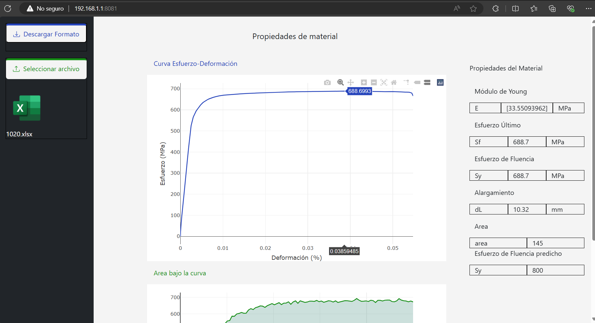

# Mechanical Properties Report Generator for Materials with Flask

This project implements a report generator for mechanical properties of materials using Flask and following an MVC (Model-View-Controller) architecture.

## Features

- **Flask MVC**: Implementation using the Model-View-Controller pattern for an organized and maintainable structure.
- **Report Generation**: Functionality to generate detailed reports on mechanical properties of materials.
- **Web Interface**: Web-based user interface for easy navigation and usage.
- **Customization**: Ability to customize parameters and features of the generated reports.

## Author

Catalina Delgado

- **Email**: catalina08delgado@gmail.com